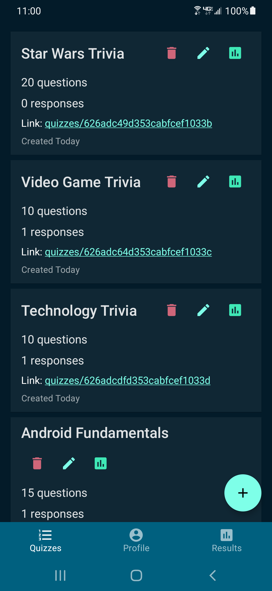
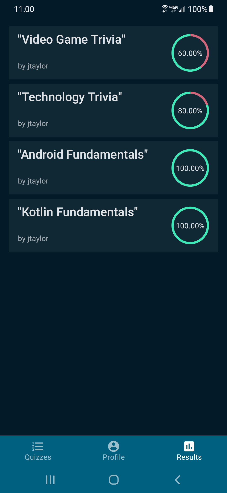

# QuizNow for Android

The Android frontend for my Quiz application ("QuizNow"). It's written in 100% Kotlin and Compose (single Activity, no Fragments).

This app has near complete feature parity with the [SPA](https://github.com/jtaylorsoftware/quizapp-web) with only minor differences, such as account deletion not being offered in-app.

It is not currently published to Google Play, although I may use this as a starting point for an app with expanded features in the future.

## Related projects:

- [React + Redux SPA](https://github.com/jtaylorsoftware/quizapp-web)
- [Express.js API](https://github.com/jtaylorsoftware/quizapp-api)

## Screenshots

(See screenshots folder for additional example screens)

  
  

